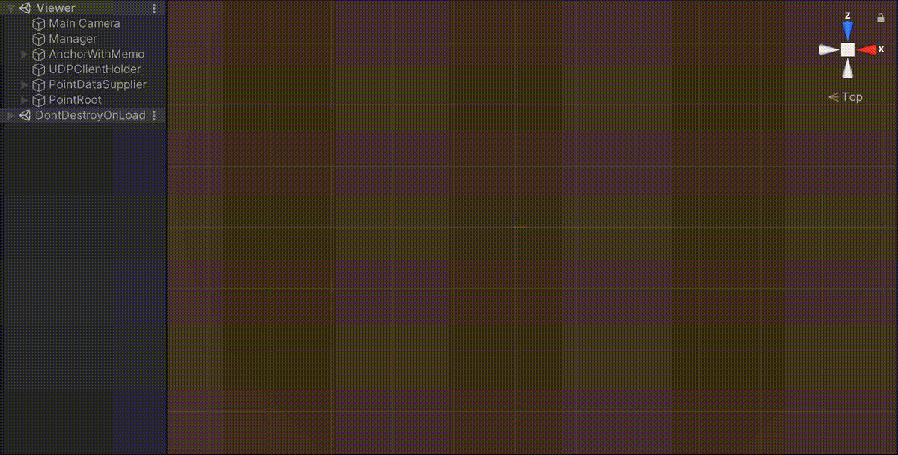
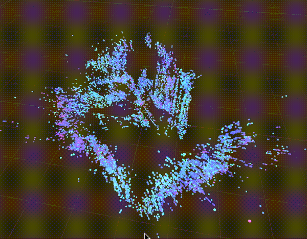

# PointCloudViewer

Scan Point Cloud with [ARFoundation](https://docs.unity3d.com/Packages/com.unity.xr.arfoundation@4.1/manual/index.html)

[ARFoundationを使って点群データ/PointCloudを計測する](https://zenn.dev/nekomimi_daimao/articles/6e1965c205b621)

--- 

| platform | version |
| ---- | ---- |
| Unity | 2021.1.15f1 |
| ARFoundation | 4.1.7 |

## Scenes

### Device

`Assets/Scenes/Device.unity`

### Viewer

`Assets/Scenes/Viewer.unity`

#### PointDataSupplier

点群の情報を生成する部分です。

- Mock  
  デバッグ用に適当な情報を生成します。`ContextMenu`から`Supply`を実行してください。
- UDP  
  デバイスから送信されてきた点群の情報を受信します。
- CSV  
  CSVに点群の情報を保存/読込する機能です。

#### PointRoot.PointViewScheme

点群を表示する部分です。

- Scheme 点群を以下の情報によって色分けします。

| 名前 | 意味 |
| ---- | ---- |
| White | 白 |
| Distance | カメラと点群の距離 |
| Confidence | 確度 |

- Distance
- Confidence 表示する点群をフィルタリングします。Distanceの単位はメートル、Confidenceの範囲は0〜1です。

#### AnchorWithMemo

`DevicePose`を反映して動きます。

## Usage

Deviceをスマートフォンにビルドし、ViewerをEditorで実行してください。  
`UDP`を介しているので同じLANに繋いでおく必要があります。

   
